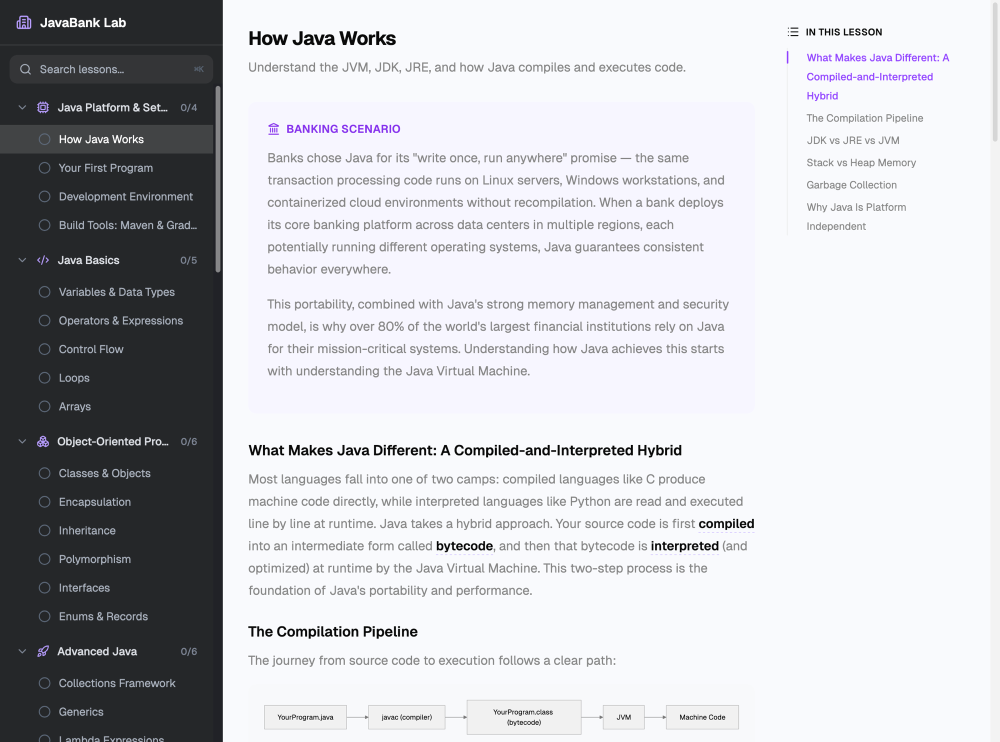

# JavaBank Lab

An interactive learning platform for Java backend development through real banking scenarios. Built with React, TypeScript, and Tailwind CSS.



## What It Teaches

10 modules, 61 lessons covering the full path from Java fundamentals to Spring Boot and production backend engineering:

1. **Java Platform & Setup** — JVM, JDK, JRE, compilation pipeline, dev environment, Maven & Gradle
2. **Java Basics** — Variables, operators, control flow, loops, arrays
3. **Object-Oriented Programming** — Classes, encapsulation, inheritance, polymorphism, interfaces, enums/records
4. **Advanced Java** — Collections, generics, lambdas, streams, exception handling, I/O
5. **Testing & Best Practices** — JUnit 5, Mockito, SOLID principles, debugging
6. **Spring Framework** — DI, configuration, project anatomy, MVC, layered architecture, JPA, entity relationships, security
7. **Spring Boot** — REST APIs, validation, JWT auth, database integration, secrets management, logging, testing, production readiness
8. **Backend Engineering** — SQL, database patterns, concurrency, caching, messaging, EDA, rate limiting, API design, resilience
9. **Capstone: Build JavaBank API** — Full project tying together Spring Boot, JPA, security, testing, and deployment
10. **Git & CI/CD** — Git fundamentals, team workflows, GitHub Actions pipelines, Docker containerization

Each lesson includes theory explanations, banking-themed scenarios, code examples with syntax highlighting, and a hands-on coding challenge with a built-in Java simulator.

## Tech Stack

- **Vite** + **React 19** + **TypeScript**
- **Tailwind CSS v4** with shadcn-style primitives
- **Monaco Editor** for the code playground
- **Shiki** for syntax highlighting in lessons
- **Mermaid** for diagrams
- **React Router** for client-side routing
- **react-markdown** + **remark-gfm** for lesson content rendering

## Getting Started

```bash
# Install dependencies
bun install

# Start dev server
bun dev

# Typecheck
bun run typecheck

# Build for production
bun run build
```

The app runs at `http://localhost:5173`.

## Project Structure

```
src/
  app.tsx                     # Routes and app shell
  main.tsx                    # Entry point
  index.css                   # Global styles and theme tokens
  types/learning.ts           # Domain types (Module, Lesson, Challenge)
  data/
    lessons.ts                # Module definitions, imports lesson markdown
    glossary.ts               # 150+ term definitions for hover tooltips
    lessons/                  # Lesson content as markdown files
      java-platform/          # Module 1 (3 lessons)
      java-basics/            # Module 2 (5 lessons)
      oop/                    # Module 3 (6 lessons)
      advanced-java/          # Module 4 (6 lessons)
      testing/                # Module 5 (4 lessons)
      spring/                 # Module 6 (5 lessons)
      spring-boot/            # Module 7 (5 lessons)
  lib/
    java-simulator.ts         # Frontend-only Java output simulator
    parse-lesson.ts           # Markdown frontmatter + section parser
    storage.ts                # localStorage persistence
    progress.tsx              # Progress context provider
    highlighter.ts            # Shared shiki highlighter instance
    lessons.ts                # Lesson lookup helpers
    utils.ts                  # cn() utility
  components/
    layout/sidebar.tsx        # Dark sidebar with module/lesson nav
    dashboard/                # Hero, progress overview (accordion)
    lesson/                   # Lesson viewer, Mermaid diagrams, code blocks
    playground/               # Monaco editor playground
    ui/                       # Button, badge, progress, card, tooltip
  pages/
    layout.tsx                # Sidebar layout with mobile hamburger
    dashboard.tsx             # Home page
    lesson.tsx                # Lesson viewer page
    challenge.tsx             # Full-screen code playground page
```

## Adding Lessons

Lessons are stored as markdown files in `src/data/lessons/{module-id}/`. Each file uses YAML frontmatter and section markers:

```markdown
---
id: "lesson-id"
moduleId: "module-id"
title: "Lesson Title"
description: "Short description"
order: 1
---

## Banking Scenario
(context)

## Content
(main educational content with ### headings and ```java code blocks)

## Why It Matters
(relevance to backend dev)

## Challenge
(instructions)

## Starter Code
```java
(code)
```

## Expected Output
```
(output)
```

## Hint
(hint)

## Solution
```java
(code)
```
```

After creating the file, import it in `src/data/lessons.ts` and add `parseLesson(rawImport)` to the module's lessons array.

Bold text in lessons that matches a term in `src/data/glossary.ts` automatically gets a hover tooltip with the definition.

## Scripts

| Command | Description |
|---------|-------------|
| `bun dev` | Start development server |
| `bun run build` | Typecheck + production build |
| `bun run typecheck` | TypeScript type checking |
| `bun run lint` | ESLint |
| `bun run format` | Prettier formatting |
| `bun run preview` | Preview production build |
