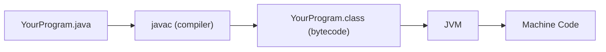
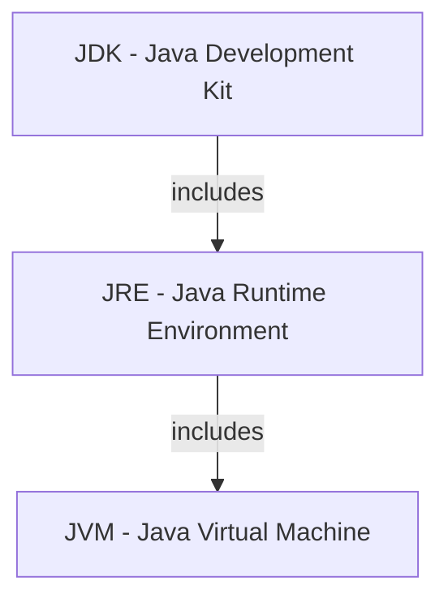

## Banking Scenario

Banks chose Java for its "write once, run anywhere" promise — the same transaction processing code runs on Linux servers, Windows workstations, and containerized cloud environments without recompilation. When a bank deploys its core banking platform across data centers in multiple regions, each potentially running different operating systems, Java guarantees consistent behavior everywhere.

This portability, combined with Java's strong memory management and security model, is why over 80% of the world's largest financial institutions rely on Java for their mission-critical systems. Understanding how Java achieves this starts with understanding the Java Virtual Machine.

## Content

### What Makes Java Different: A Compiled-and-Interpreted Hybrid

Most languages fall into one of two camps: compiled languages like C produce machine code directly, while interpreted languages like Python are read and executed line by line at runtime. Java takes a hybrid approach. Your source code is first **compiled** into an intermediate form called **bytecode**, and then that bytecode is **interpreted** (and optimized) at runtime by the Java Virtual Machine. This two-step process is the foundation of Java's portability and performance.

### The Compilation Pipeline

The journey from source code to execution follows a clear path:



1. You write source code in a `.java` file.
2. The `javac` compiler checks your code for errors and translates it into **bytecode** — a set of instructions stored in a `.class` file.
3. The **JVM** reads the bytecode and translates it into native machine instructions for whatever platform it is running on.

The bytecode in the `.class` file is **platform-independent** — it contains generic instructions that are not tied to any operating system or CPU. The JVM is **platform-specific** — Oracle, the open-source community, and other vendors build a separate JVM for each operating system (Windows, macOS, Linux, etc.), and each one knows how to translate the same bytecode into native machine instructions for its host platform. That separation is the key insight: you compile once, and any platform's JVM can run the result.

```java
// This source code compiles to the SAME bytecode
// regardless of your operating system
public class TransactionProcessor {
    public static void main(String[] args) {
        System.out.println("Processing transaction...");
    }
}
```

### JDK vs JRE vs JVM

Think of these as concentric layers:



- **JVM** — The engine that runs bytecode. There is a different JVM implementation for each operating system. *JS equivalent: the V8 engine inside Chrome or Node.js — it reads and executes your code.*
- **JRE** — The JVM plus the standard class libraries your programs need at runtime. *JS equivalent: Node.js itself — V8 plus built-in modules like `fs`, `http`, and `path` that your code can use.*
- **JDK** — The JRE plus development tools like the compiler (`javac`), debugger (`jdb`), and documentation generator (`javadoc`). This is what you install to write Java code. *JS equivalent: Node.js + npm + your toolchain (TypeScript compiler, ESLint, etc.) — everything you need to both write and run code.*

### Stack vs Heap Memory

Before we talk about memory, you will see the word **thread** come up. A thread is simply a single sequence of work that the JVM is executing. Think of it as one bank teller at a counter — they handle one customer at a time, step by step. A Java program starts with one thread (the `main` thread), but it can spin up additional threads to do multiple things at once, just like a bank opens more teller windows during the lunch rush. Each teller works independently, but they all share access to the same filing cabinet (the heap). You don't need to create threads yourself right now — just know that when we say "thread," we mean one worker doing one sequence of tasks.

The JVM manages two primary regions of memory. A real-world way to think about it:

- **Stack** is like a stack of sticky notes on your desk. When your manager says "process this deposit," you grab a fresh sticky note, jot down the details (amount, account number), do the work, and toss the note when you're done. Each task gets its own note, and you always work from the top of the pile. Fast, temporary, and personal to you — no one else touches your sticky notes.

- **Heap** is like the bank's filing cabinet. When a customer opens a new account, you create a folder with all their information and file it in the shared cabinet. That folder stays there long after you've tossed your sticky note. Any teller (thread) can walk over and pull the folder when they need it. Folders only get cleaned out when nobody needs them anymore (garbage collection).

In JVM terms:

- **Stack** — Stores method calls and local variables. Each thread gets its own stack. When a method is called, a new "frame" is pushed onto the stack; when it returns, the frame is popped. Stack memory is fast and automatically managed.
- **Heap** — Stores all objects created with `new`. The heap is shared across all threads. When you write `Account account = new Account()`, the `Account` object lives on the heap, while the `account` reference variable lives on the stack.

```java
public void processDeposit() {
    double amount = 500.0;           // 'amount' lives on the STACK
    Account acc = new Account();     // 'acc' reference on STACK, Account object on HEAP
    acc.deposit(amount);
}
// When this method ends, 'amount' and 'acc' are popped off the stack.
// The Account object on the heap becomes eligible for garbage collection.
```

### Garbage Collection

In languages like C, you must manually allocate and free memory. Forget to free it, and you get a memory leak. Free it too early, and you get a crash. Java eliminates this entire class of bugs with **garbage collection** (GC).

The JVM's garbage collector automatically identifies objects on the heap that are no longer reachable — meaning no variable references them — and reclaims their memory. You never call `free()` or `delete`. The GC runs in the background, and modern JVMs use sophisticated algorithms (like G1 or ZGC) to minimize pauses.

For banking systems processing millions of transactions, predictable GC behavior is critical. A long GC pause during peak trading hours could mean missed transactions.

### Why Java Is Platform Independent

The answer is simple: **bytecode is universal, and each platform has its own JVM**. When you compile a Java program on Windows, the resulting `.class` file contains bytecode that any JVM can execute — whether that JVM runs on Linux, macOS, or a mainframe. The JVM acts as a translation layer, converting the same bytecode into the appropriate machine instructions for its host platform.

This is fundamentally different from C or C++, where compiled binaries are tied to a specific operating system and CPU architecture.

## Why It Matters

In a real banking environment, the same compiled Java application might run on a developer's MacBook, a QA team's Windows machines, a staging environment on Linux VMs, and a production Kubernetes cluster — all from the same build artifact. Understanding the JVM, memory model, and compilation pipeline is not academic trivia. It directly impacts how you debug production issues, tune garbage collection for low-latency trading systems, and reason about where your objects live in memory when a transaction fails at 2 AM.

## Questions

Q: What does the Java compiler (javac) produce?
A) Machine code for the current operating system
B) Platform-independent bytecode (.class files)
C) An executable binary (.exe)
D) JavaScript code
Correct: B

Q: Where do objects created with `new` live in JVM memory?
A) The stack
B) The classpath
C) The heap
D) The bytecode
Correct: C

Q: What is the role of the garbage collector?
A) Compiling Java source code to bytecode
B) Automatically reclaiming memory from unreachable objects
C) Loading classes from the classpath
D) Optimizing bytecode at compile time
Correct: B

## Challenge

Write a program that prints the Java version and JVM name currently running on your system using `System.getProperty()`.

## Starter Code

```java
public class JavaEnvironment {
    public static void main(String[] args) {
        // TODO: Get the Java version using System.getProperty("java.version")
        // TODO: Get the JVM name using System.getProperty("java.vm.name")
        // TODO: Print both values with descriptive labels
    }
}
```

## Expected Output

```
Java Version: 21.0.1
JVM Name: OpenJDK 64-Bit Server VM
```

## Hint

`System.getProperty(String key)` returns a String value for the given system property. Use `"java.version"` and `"java.vm.name"` as keys. The actual values will vary depending on your installed JDK.

## Solution

```java
public class JavaEnvironment {
    public static void main(String[] args) {
        String javaVersion = System.getProperty("java.version");
        String jvmName = System.getProperty("java.vm.name");

        System.out.println("Java Version: " + javaVersion);
        System.out.println("JVM Name: " + jvmName);
    }
}
```
